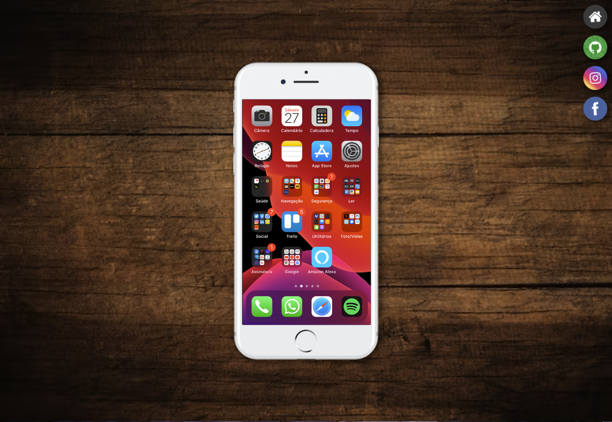
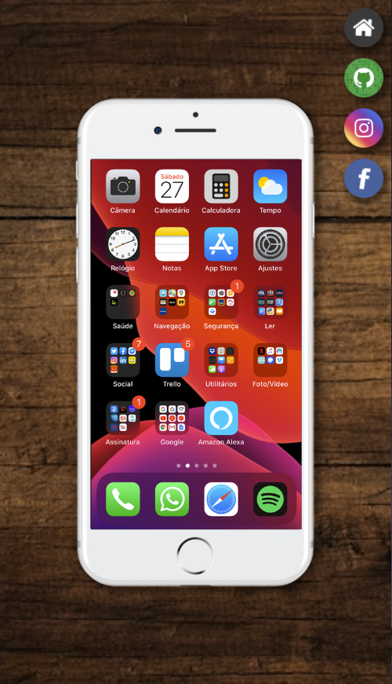

<h1 align="center">social-media</h1>

[PC Version](#pc-version) | [Mobile Version](#mobile-version) | [Techs](#techs) | [To Access](https://kaiquecamposdev.github.io/social-media/)

## 💻 PC Version  

## 📱 Mobile Version 

  

### 🚀 Techs 

- HTML5
- CSS3

Thank you for attention <3

